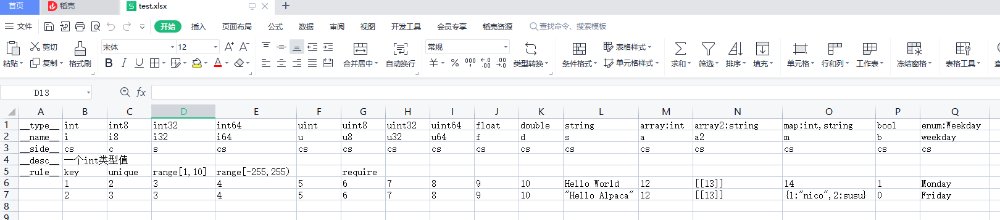
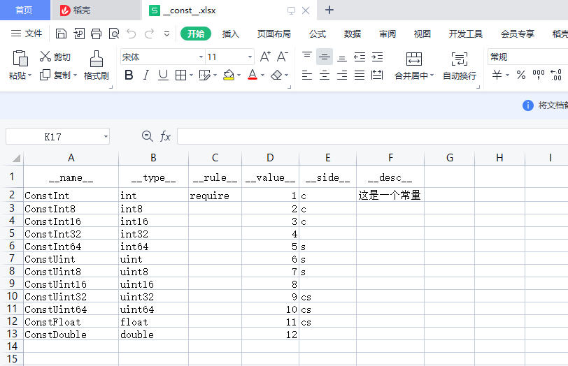
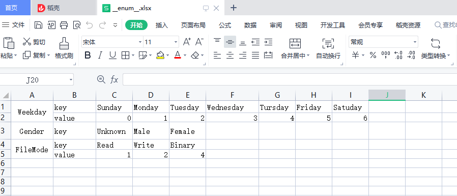

# alpaca

alpaca 是一个简单的游戏配置生成工具，能过读取 excel 文件，生成 json 和各种语言的配置类

## 使用方法

```bash
alpaca -dir=/path/to/excels -json_out=/path/to/gen/json -go_out=/path/to/gen/go
```

## 配置方式

### 基础配置


首列为行类型配置，支持 5 种行类型配置（两端为双下划线）

|字段|描述|备注
|-|-|-
|`__type__`|列的类型|&nbsp;
|`__name__`|列的名称|&nbsp;
|`__side__`|生成端|c=客户端, s=服务端
|`__desc__`|列的描述|&nbsp;
|`__rule__`|可对列进行一些规则限制|&nbsp;

#### 支持的 type

|类型|列表|备注
|-|-|-
|整型|`int` `int8` `int16` `int32` `int64`|&nbsp;
|无符号整型|`uint` `uint8` `uint16` `uint32` `uint64`|&nbsp;
|浮点数|`float` `double`|&nbsp;
|布尔值|`bool`|&nbsp;
|字符串|`string`|&nbsp;
|数组|`array:type` `array2:type`|&nbsp;
|字典|`map:ktype,vtype`|&nbsp;
|枚举|`enum:etype`|`etype` 为枚举表配置

#### 验证规则 rule

|字段|描述|备注
|-|-|-
|`key`|主键|包含了 `unique` 和 `require` 规则，目前仅支持一个主键
|`unique`|唯一|&nbsp;
|`require`|必填|&nbsp;
|`range[min,max]`|数值范围限定|区间可开可闭，如 `range(1,10]` `range[1,10)`
|`length[min,max]`|限定长度|对 `string` 和集合类有效

### 常量配置


常量配置属于特殊的基础配置，本质就是把基础表的一行数据变成一列，因此字段类型跟基础配置是一样的。

> ps: key rule 对常量配置无效

### 枚举配置



枚举表必须命名为 `__enum__.xls` 或者 `__enum__.xlsx`
首列为枚举名
第二列必须有 `key` 字段，表示枚举键
`value` 字段可选，为整型，不填则 `key` 的值依次从 `0` 递增

## Todo List

- ~~支持多配置数据来源~~ (放弃)
  - [x] Excel
- 支持多语言配置类生成
  - [x] Golang
  - [ ] Java
  - [ ] C/C++
  - [ ] C#
  - [ ] Js/Ts
- ~~支持多格式导出~~ (放弃)
  - [x] json
  - [ ] ~~xml~~
  - [ ] ~~lua~~
